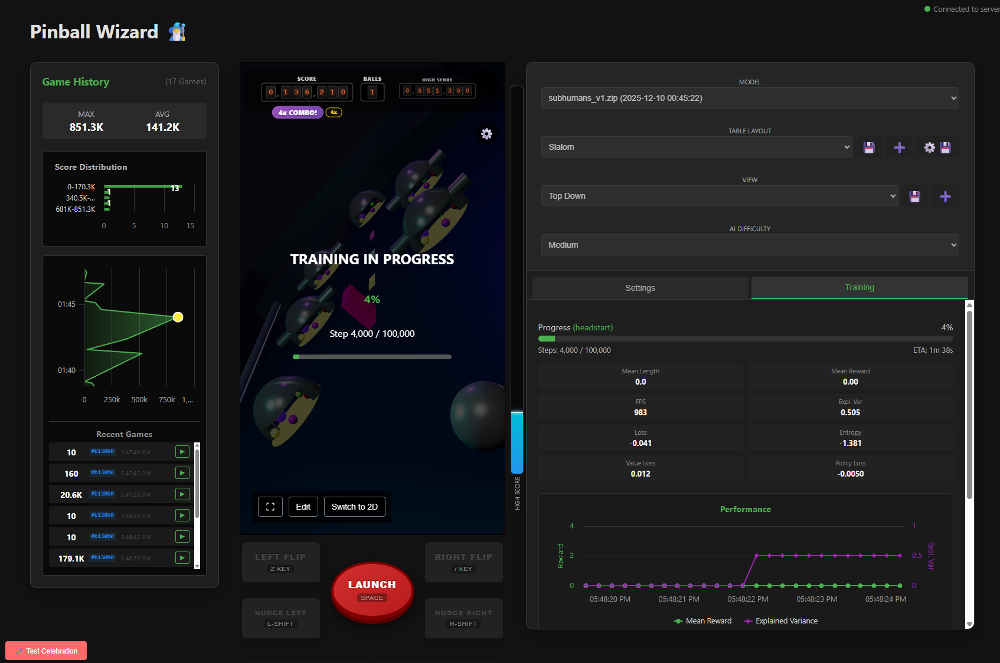

# Pinball Wizard 🧙‍♂️

A reinforcement learning agent for playing pinball, featuring a deterministic replay system, live 3D visualization,
and a web-based layout editor.

- **Web Visualization**: Live web interface (Vue 3 + Three.js) to watch the agent "think" and play in real-time.
- **3D Simulator**: Fully interactive 3D view with realistic physics (Pymunk), including tapered flippers and rubber bounce.
- **Dynamic Physics Config**: Adjust gravity, friction, ball mass, and flipper mechanics on the fly.
- **Layout Editor**: Built-in 3D editor to drag & drop rails and bumpers directly in the browser.
- **Mobile & Foldable Support**: Responsive UI optimized for desktop and Galaxy Z Fold devices.
- **Deterministic Replay System**: Automatically record and replay games with standard cryptographic hashing to verify high scores and shared replays.
- **Mothership Boss Battle**: Dynamic boss fights with destructible environments and multi-stage mechanics.
- **High Score System**: Track your best games with visual celebrations, fireworks, and persistent history.

## Desktop


## Training


## Mobile


## 🛠️ Installation

1.  **Clone the repository**
    ```bash
    git clone https://github.com/scyanrizzbery/pinball-wizard.git
    cd pinball-wizard
    ```

2.  **Using Docker (Recommended)**
    Ensure you have Docker and Docker Compose installed.
    ```bash
    docker compose up
    ```

3.  **Local Installation (Dev)**
    ```bash
    pip install -r requirements.txt
    ```

## 🚀 Usage

### 1. Manual Play Mode
Test the physics and controls yourself without the AI.

*(Note: `main.py` defaults to manual play if no model is loaded)*

- **Controls**:
    - `z`: Left Flipper
    - `/`: Right Flipper
    - `Space`: Launch Ball
    - `Left Shift`: Nudge Left
    - `Right Shift`: Nudge Right

### 2. Train the Agent (Simulation)
Train the bot in the simulated environment. This runs the physics engine, vision system, and PPO agent loop.

### 3. Hyperparameter Optimization (Optuna)
Auto-tune the RL agent's learning parameters (learning rate, entropy, etc.) for better performance.
- **Real-time Progress**: The web UI (`http://localhost:5000`) visualizes the optimization trials in real-time.
- **Optuna Dashboard**: View detailed trial statistics and parameter importance at `http://localhost:8080`.
- **Apply Results**: The best hyperparameters are automatically saved to `frontend/public/hyperparams.json` and loaded by the UI for future training sessions.


## 📂 Project Structure

- **`pbwizard/`**: Core package
    - **`agent.py`**: RL agent implementation (PPO/Reflex).
    - **`environment.py`**: Gymnasium environment wrapper.
    - **`vision.py`**: Vision system (Real & Simulated), Physics Engine integration.
    - **`physics.py`**: Pymunk physics engine wrapper and collision logic.
    - **`hardware.py`**: GPIO control for real flippers.
    - **`web_server.py`**: Flask/SocketIO server for visualization and control.
- **`frontend/`**: Vue 3 + Vite frontend application.
    - **`src/components/Pinball3D.vue`**: Main 3D game view (Three.js).
    - **`src/components/ReplayIndicator.vue`**: Replay status and hash display.
- **`train.py`**: Script for training the agent.
- **`main.py`**: Entry point for play/inference mode.
- **`tests/`**: Python unit tests.
- **`cypress/`**: End-to-end Cypress tests.

## 🧠 Technical Architecture

### Deterministic Replay System
To ensure fair competition and verifiable high scores, the game uses a deterministic replay system:
- **Game Hash**: A SHA-256 hash is generated from the initial random seed, layout configuration, and physics parameters.
- **Input Logging**: All user inputs (flippers, nudges, launch) are recorded with their exact frame timestamp.
- **Playback**: During replay, the physics engine is re-seeded with the original seed, and inputs are injected at the exact same frames, guaranteeing an identical outcome.

### Communication Channels
The system uses a hybrid communication architecture:

1.  **Frontend <-> Backend (Socket.IO)**:
    -   **Video Stream**: JPEG-encoded frames via `video_frame` event (~30 FPS).
    -   **Telemetry**: Game stats (score, ball count, physics params, replay hash) via `stats_update`.
    -   **Control**: User inputs and config changes via `input_event` and `update_physics_v2`.
    -   **Replay**: Replay loading and status updates via `load_replay` and `replay_status`.

2.  **Internal Process Communication (Multiprocessing)**:
    -   **Training Mode**: The training loop runs in a separate process to avoid blocking the web server.

### Decision Space (RL Environment)

**Observation Space (Continuous)**:
Normalized vector (8 values):
-   `ball_x`, `ball_y`, `ball_vx`, `ball_vy` (Ball state)
-   `target_1`, `target_2`, `target_3`, `target_4` (Drop target states)

**Action Space (Discrete)**:
4 possible actions at every step (~30Hz):
-   `NOOP`, `FLIP_LEFT`, `FLIP_RIGHT`, `FLIP_BOTH` 

**Reward Function**:
-   **Score**: +1.0 per 100 points.
-   **Survival**: +0.2 per step.
-   **Penalties**: -5.0 for ball loss, -0.5 for trapping >3s.

## 🧪 Testing

### Unit Tests (Python)
```bash
docker-compose --profile test up
```

### E2E Tests (Cypress)
```bash
# Run all E2E tests in Docker
docker compose --profile e2e up
```

## ⚙️ Configuration

Environment variables in `.env`:
- `SIMULATION_MODE`: `True` for sim, `False` for real camera.
- `DEBUG_MODE`: `True` to use mock hardware.
- `GPIO_PIN_LEFT_FLIPPER`: GPIO pin for left flipper.
- `GPIO_PIN_RIGHT_FLIPPER`: GPIO pin for right flipper.

## 🤖 Acknowledgments

Majority of the development for this project was done in **Google Antigravity** with Google Gemini 3 Pro.

## 📝 License

MIT