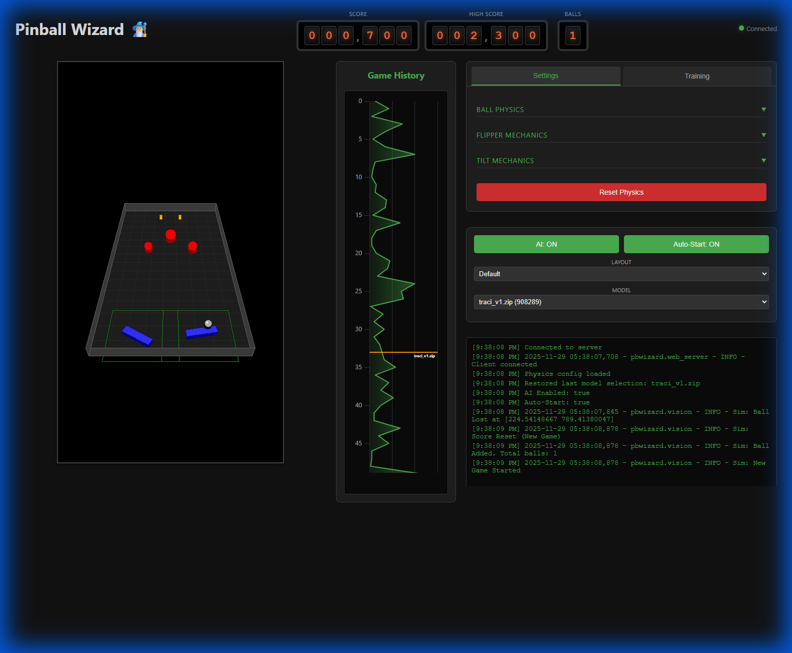

# Pinball Wizard 🧙‍♂️

A reinforcement learning agent for playing pinball.

- **Web Visualization**: Live web interface to watch the agent "think" and play in real-time.
- **Manual Play Mode**: Test the physics and controls yourself via the web interface.
- **Dynamic Physics Config**: Adjust gravity, friction, and flipper angles on the fly from the UI.

## Desktop


## Mobile


## 🛠️ Installation

1.  **Clone the repository**
    ```bash
    git clone https://github.com/scyanrizzbery/pinball-wizard.git
    cd pinball-wizard
    ```

2.  **Using Docker (Recommended)**
    Ensure you have Docker and Docker Compose installed.
    ```bash
    docker compose build
    ```

3.  **Local Installation (Dev)**
    ```bash
    pip install -r requirements.txt
    ```

## 🚀 Usage

### 1. Train the Agent (Simulation)
Train the bot in the simulated environment. This runs the physics engine, vision system, and PPO agent loop.
```bash
docker compose run --rm -p 5000:5000 pinball-bot python train.py
```
- Open `http://localhost:5000` to watch the training live.
- Metrics are logged to the console.

### 2. Manual Play Mode
Test the physics and controls yourself without the AI.
```bash
docker compose run --rm -p 5000:5000 pinball-bot python main.py
```
*(Note: `main.py` defaults to manual play if no model is loaded)*

- **Controls**:
    - `z`: Left Flipper
    - `/`: Right Flipper
    - `Space`: Launch Ball

### 3. Real Hardware Mode
To run on a Raspberry Pi connected to a pinball machine:
1.  Connect the webcam and GPIO pins to the flipper solenoids.
2.  Update `.env` with your hardware config.

## 📂 Project Structure

- **`pbwizard/`**: Core package
    - **`agent.py`**: RL agent implementation (PPO/Reflex).
    - **`environment.py`**: Gymnasium environment wrapper.
    - **`vision.py`**: Vision system (Real & Simulated).
    - **`hardware.py`**: GPIO control for flippers.
    - **`web_server.py`**: Flask/SocketIO server for visualization.
- **`train.py`**: Script for training the agent.
- **`main.py`**: Entry point for play/inference mode.
- **`tests/`**: Python unit tests.
- **`cypress/`**: End-to-end Cypress tests.

## 🧠 Technical Architecture

### Communication Channels

The system uses a hybrid communication architecture to ensure low-latency control while providing a rich user interface.

1.  **Frontend <-> Backend (Socket.IO)**:
    -   **Video Stream**: The backend streams JPEG-encoded frames via the `video_frame` event (~30 FPS).
    -   **Telemetry**: Game stats (score, ball count, physics params) are broadcast via the `stats` event.
    -   **Control**: User inputs (flippers, nudges) and configuration changes (gravity, AI toggle) are sent to the backend via `input_event` and `update_physics_v2`.

2.  **Internal Process Communication (Multiprocessing)**:
    -   When in **Training Mode**, the training loop runs in a separate process to avoid blocking the web server.
    -   **State Queue**: The training worker pushes the current simulation state (ball position, flipper angles) to the main process for visualization.
    -   **Command Queue**: The main process sends control commands (e.g., `STOP`) to the worker.
    -   **Status Queue**: The worker reports training progress and statistics back to the main process.

### Decision Space (RL Environment)

The Reinforcement Learning agent interacts with the `PinballEnv` (Gymnasium wrapper).

**Observation Space (Continuous)**:
A normalized vector of 4 floating-point values:
-   `ball_x`: Horizontal position (0.0 - 1.0)
-   `ball_y`: Vertical position (0.0 - 1.0)
-   `ball_vx`: Horizontal velocity (normalized)
-   `ball_vy`: Vertical velocity (normalized)

**Action Space (Discrete)**:
The agent chooses one of 6 possible actions at every step (~30Hz):
0.  **No-op**: Release all flippers.
1.  **Flip Left**: Hold left flipper.
2.  **Flip Right**: Hold right flipper.
3.  **Flip Both**: Hold both flippers.
4.  **Nudge Left**: Shake table left.
5.  **Nudge Right**: Shake table right.

**Reward Function**:
-   **Score**: +1.0 for every 100 points scored.
-   **Survival**: +0.2 per step the ball is alive.
-   **Height Bonus**: Small reward for keeping the ball high on the playfield.
-   **Penalties**:
    -   -5.0 for losing a ball.
    -   -0.5 for holding the ball (trapping) for >3 seconds.

## 🧪 Testing

### Unit Tests (Python)
```bash
docker-compose --profile test up
```

### E2E Tests (Cypress)
```bash
# Run all E2E tests in Docker
docker compose --profile e2e up cypress
```

For detailed testing instructions, see:
- **E2E Docker Guide**: `E2E_DOCKER_GUIDE.md`
- **Cypress Documentation**: `cypress/README.md`

## ⚙️ Configuration

Environment variables can be set in `.env`:
- `SIMULATION_MODE`: `True` for sim, `False` for real camera.
- `DEBUG_MODE`: `True` to use mock hardware.
- `GPIO_PIN_LEFT_FLIPPER`: GPIO pin for left flipper.
- `GPIO_PIN_RIGHT_FLIPPER`: GPIO pin for right flipper.

## 🤖 Acknowledgments

Majority of the development for this project was done in **Google Antigravity** with Google Gemini 3 Pro.

## 📝 License

MIT