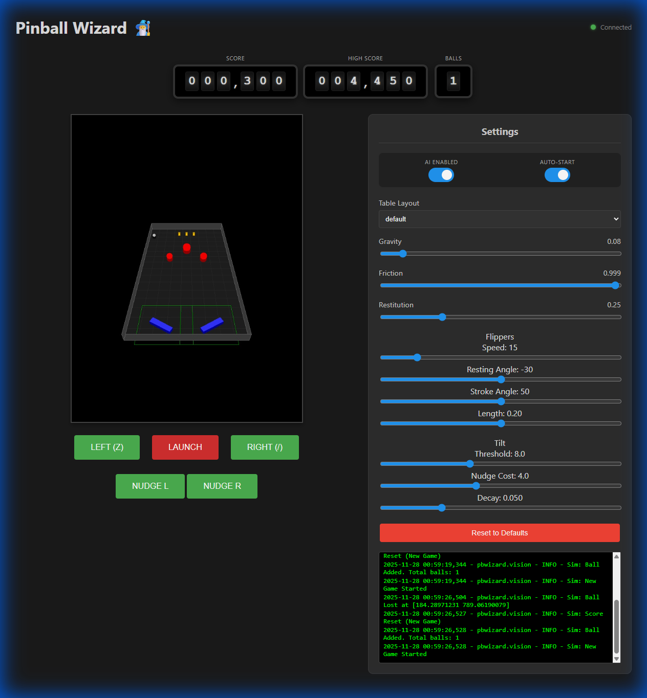

# Pinball Wizard 🧙‍♂️

A reinforcement learning agent for playing pinball.

- **Web Visualization**: Live web interface to watch the agent "think" and play in real-time.
- **Manual Play Mode**: Test the physics and controls yourself via the web interface.
- **Dynamic Physics Config**: Adjust gravity, friction, and flipper angles on the fly from the UI.



## 🛠️ Installation

1.  **Clone the repository**
    ```bash
    git clone https://github.com/scyanrizzbery/pinball-wizard.git
    cd pinball-wizard
    ```

2.  **Using Docker (Recommended)**
    Ensure you have Docker and Docker Compose installed.
    ```bash
    docker compose build
    ```

3.  **Local Installation (Dev)**
    ```bash
    pip install -r requirements.txt
    ```

## 🚀 Usage

### 1. Train the Agent (Simulation)
Train the bot in the simulated environment. This runs the physics engine, vision system, and PPO agent loop.
```bash
docker compose run --rm -p 5000:5000 pinball-bot python train.py
```
- Open `http://localhost:5000` to watch the training live.
- Metrics are logged to the console.

### 2. Manual Play Mode
Test the physics and controls yourself without the AI.
```bash
docker compose run --rm -p 5000:5000 pinball-bot python play.py
```
- **Controls**:
    - `z`: Left Flipper
    - `/`: Right Flipper
    - `Space`: Launch Ball

### 3. Real Hardware Mode
To run on a Raspberry Pi connected to a pinball machine:
1.  Connect the webcam and GPIO pins to the flipper solenoids.
2.  Update `.env` with your hardware config.

## 📂 Project Structure

- **`pbwizard/`**: Core package
    - **`agent.py`**: RL agent implementation (PPO/Reflex).
    - **`environment.py`**: Gymnasium environment wrapper.
    - **`vision.py`**: Vision system (Real & Simulated).
    - **`hardware.py`**: GPIO control for flippers.
    - **`web_server.py`**: Flask/SocketIO server for visualization.
- **`train.py`**: Script for training the agent.
- **`play.py`**: Script for manual play.

## ⚙️ Configuration

Environment variables can be set in `.env`:
- `SIMULATION_MODE`: `True` for sim, `False` for real camera.
- `DEBUG_MODE`: `True` to use mock hardware.
- `GPIO_PIN_LEFT_FLIPPER`: GPIO pin for left flipper.
- `GPIO_PIN_RIGHT_FLIPPER`: GPIO pin for right flipper.

## 🧠 How it Works

1.  **Vision**: The camera (or sim) captures the playfield.
2.  **Perception**: `BallTracker` finds the ball coordinates. `ZoneManager` determines if the ball is in a "flippable" zone.
3.  **Decision**: The Agent (PPO) receives the state `[x, y, vx, vy]` and decides to Flip Left, Flip Right, Flip Both, or Hold.
4.  **Action**: The `FlipperController` triggers the hardware (or simulated physics).
5.  **Learning**: The agent receives rewards for keeping the ball alive and scoring points, gradually improving its policy.

## 📝 License

MIT
